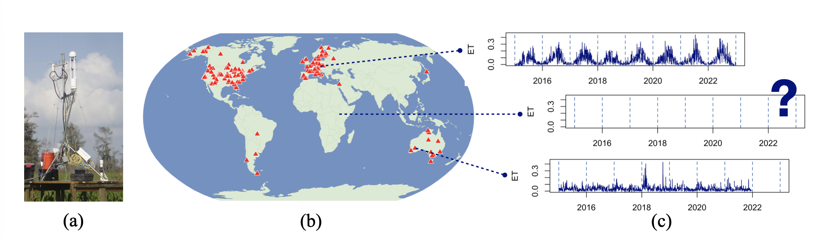
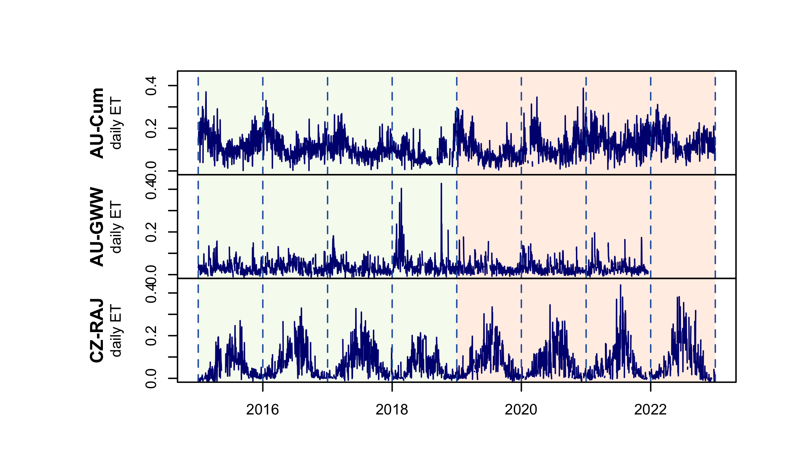
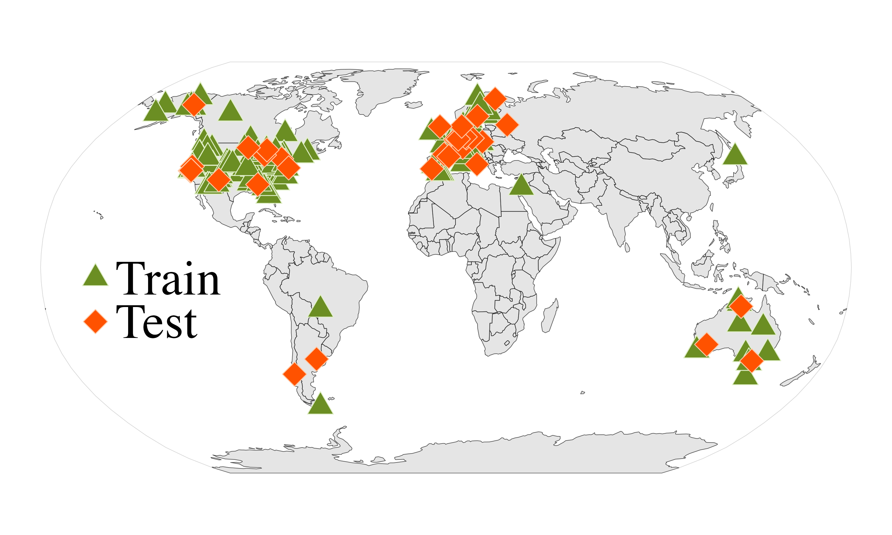
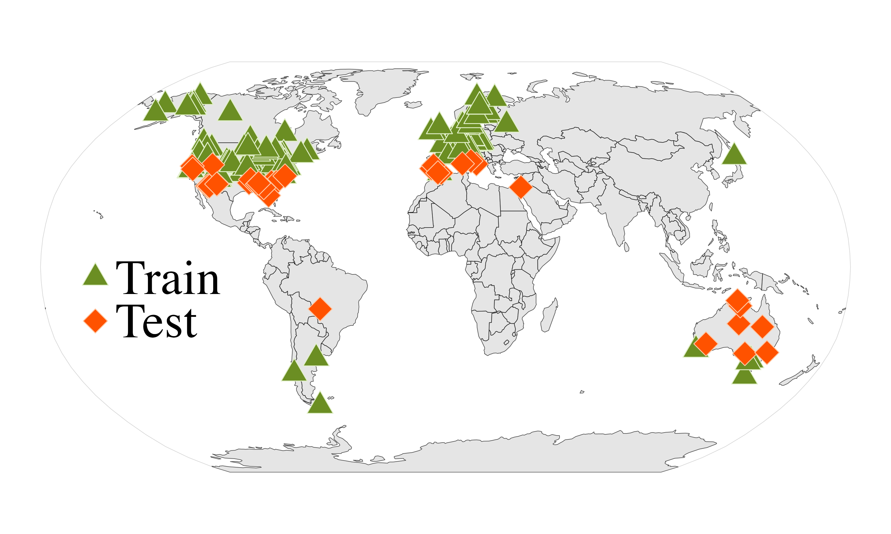
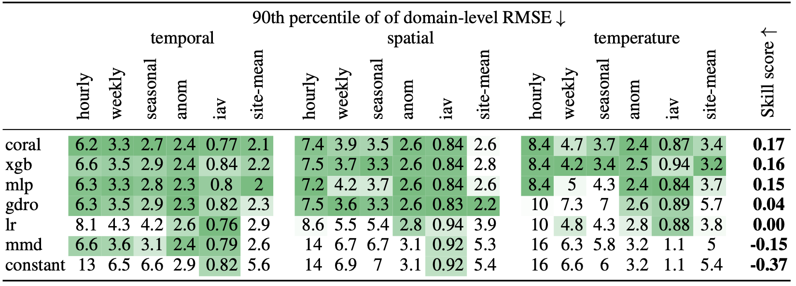

# Fluxtrapolation: A benchmark on extrapolating ecosystem fluxes

A benchmark for evaluating ML models under distribution shift using FLUXNET eddy covariance data from 207 sites worldwide. Models are trained to predict ecosystem carbon and water fluxes and evaluated on held-out sites or time periods to measure robustness to covariate shift.

**Targets:** GPP (gross primary productivity), NEE (net ecosystem exchange), ET (evapotranspiration / latent heat flux).


(a) An example of an eddy covariance tower (Photo: Ken W. Krauss, U.S. Geological Survey. Public domain), (b) The FLUXNET tower locations, (c) ET time series at two example towers, and the idea of upscaling: producing ET estimates at locations without towers.

---

## Setup

```bash
python -m venv venv_fn
source venv_fn/bin/activate
pip install -r requirements.txt
```

PyTorch uses CPU by default. For GPU support, install the appropriate CUDA version of PyTorch separately.

---

## Data

**Instructions on how to obtain the data are coming shortly.**

Each site is stored as a CSV in `data/sites/`. The benchmark uses **13 covariates** per hourly observation:
- **Meteorological:** air temperature (TA), vapor pressure deficit (VPD), incoming shortwave radiation (SW\_IN), and others
- **Site characteristics:** IGBP vegetation type
- **Satellite-derived:** enhanced vegetation index (EVI), land surface temperature (LST), normalized difference water index (NDWI), and others

---

## Distribution Shift Settings

|  | `time-split` | `spatial-easy40` | `TA40` |
|--|---|---|---|
| **Description** | Train on years before 2018, validate on 2018, test on years after 2018 | Hold out 40 predefined test sites; train/validate on the rest | Hold out 25 warmer southern sites; train/validate on northern sites |
| **Diagram** |  |  |  |
| **Tests** | Temporal generalization — can a model trained on earlier years predict future flux dynamics? | Spatial generalization to new ecosystems across climate types | Robustness to a climate gradient — training and test sites differ systematically in temperature regime |


Run `--setting all` to run all three (default).

---

## The goal

Once you have trained a model, we wish to evaluate it over the median and 90th percentile of held-out sites and site-years, along with several temporal aggregates. For example, we can look at ET and the 90th percentiles of RMSE. Good models do not degrade badly for any of the metrics.



In more detail, one can look at the CDFs for an (extapolation scenario, aggregation) pair. For example for RMSE of weekly ET in the temperature-based extrapolation, we see that models whcih appear more similar at the median diverge further in the tails.

<p align="center">
  
</p>

---

## Training

Train a model and save predictions + metrics:

```bash
python train_model.py --setting time-split --target GPP --model_name xgb
```

| Argument | Options | Default | Description |
|----------|---------|---------|-------------|
| `--path` | path | `data/` | Data directory |
| `--setting` | `time-split`, `spatial-easy40`, `TA40`, `all` | `all` | Distribution shift scenario |
| `--target` | `GPP`, `NEE`, `ET`, `all` | `all` | Target variable |
| `--model_name` | see table below | `lr` | Model to train |
| `--rerun` | flag | off | Overwrite existing results |

Training performs random hyperparameter search and selects the best model under three validation strategies: `mean` (average site RMSE), `max` (worst-site RMSE), and `discrepancy` (max − min site RMSE). Results for all three strategies are saved.

### Available models

| Name | Description | Extra install |
|------|-------------|---------------|
| `lr` | Linear Regression | — |
| `ridge` | Ridge Regression | — |
| `robust-lr` | Huber Regressor | — |
| `xgb` | XGBoost | — |
| `lightgbm` | LightGBM | `pip install lightgbm` |
| `constant` | Dummy mean predictor | — |
| `mlp` | Multi-layer Perceptron (PyTorch) | — |
| `gdro` | Group DRO — minimizes worst-group loss (PyTorch) | — |
| `coral` | CORAL domain generalization (PyTorch) | — |
| `mmd` | MMD domain generalization (PyTorch) | — |

---

## Evaluation

Metrics are computed automatically during training. To regenerate plots and leaderboards:

```bash
python eval.py --target GPP --val_strategy mean
```

| Argument | Options | Default |
|----------|---------|---------|
| `--target` | `GPP`, `NEE`, `ET`, `all` | `all` |
| `--setting` | `time-split`, `spatial-easy40`, `TA40` | all |
| `--model` | model name | all |
| `--metric` | `rmse`, `mae`, `nse`, `r2_score`, `bias` | `rmse` |
| `--val_strategy` | `mean`, `max`, `discrepancy` | `mean` |
| `--rerun` | flag | off | Recompute metrics from saved predictions |

**Metrics** are reported at 6 temporal scales: hourly, weekly seasonal (mean seasonal cycle), anomalies, inter-annual variability, and site mean. The leaderboard iand CDFs are, respectively, at `results/plots/{strategy}/leaderboard_{target}.html` and `results/plots/{strategy}/cdf_{target}_{metric}_{scale}.png`.

**Outputs** are saved to `results/`:

```
results/
├── models/      # predictions CSVs + best hyperparameters (JSON)
├── metrics/     # per-scale metrics CSVs
└── plots/
    ├── mean/
    ├── max/
    └── discrepancy/
```

File naming follows `{setting}_{target}_{model}_val_{strategy}*`. 

---

## Adding Your Own Model

### Step 1 — Create `models/my_model.py`

Implement `fit` and `predict` with the following interface:

```python
class MyModel:
    def __init__(self, param1=1.0):
        self.param1 = param1

    def fit(self, X, y, eval_set=None, envs=None):
        """
        X, y   : np.ndarray (or torch.Tensor if you opt into tensor mode — see Step 4)
        eval_set: optional [(X_val, y_val)] for early stopping
        envs   : optional array of site labels, for group-aware methods
        """
        ...
        return self

    def predict(self, X):
        """Returns np.ndarray of shape (n_samples,)."""
        ...
```

`eval_set` and `envs` are **optional** — the benchmark detects them via introspection and only passes them if your `fit` signature includes them. Leave them out if you don't need them.

For a PyTorch example, see [models/mlp.py](models/mlp.py). For a group-aware example that uses `envs`, see [models/gdro.py](models/gdro.py).

### Step 2 — Register in `models/__init__.py`

Add an `elif` branch to `get_model()`:

```python
elif model_name == 'my-model':
    from .my_model import MyModel
    return MyModel(**params)
```

### Step 3 — Add hyperparameter search in `get_random_params()`

In the same file, add a branch to `get_random_params()`:

```python
elif model_name == 'my-model':
    params = {
        'param1': np.random.uniform(0.1, 10.0),
    }
```

Return `[{}]` if your model has no hyperparameters.

### Step 4 — (PyTorch only) Update `train_model.py`

If your model requires `torch.Tensor` inputs, add its name to the two lists on lines 62–63 of [train_model.py](train_model.py):

```python
standardize=model_name in ['robust-lr', 'ridge', 'mlp', 'gdro', 'coral', 'mmd', 'my-model'],
astorch=model_name in ['mlp', 'gdro', 'coral', 'mmd', 'my-model']
```

Skip this step if your model works with numpy arrays.

### Step 5 — Run

```bash
python train_model.py --model_name my-model --setting time-split --target GPP
```

---

## References

Pastorello, G. et al. (2020) 'The FLUXNET2015 dataset and the ONEFlux processing pipeline for eddy covariance data', *Scientific Data*, 7(1), p. 225. https://doi.org/10.1038/s41597-020-0534-3
