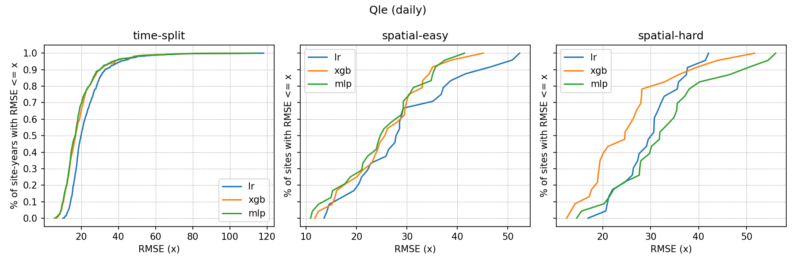

# FLUXNET Benchmark for Domain Generalization

The FLUXNET benchmark is a framework for evaluating machine learning models under distribution shift using FLUXNET ecosystem flux data. It provides standardized train/test splits and evaluation metrics to enable fair comparison of domain generalization methods.

The benchmark tests model performance on predicting **GPP (Gross Primary Productivity), NEE (Net Ecosystem Exchange), and Qle (Latent Heat Flux)** across different temporal and spatial splits.

Information about the FLUXNET data: https://pad.gwdg.de/s/yuCtk9fj5

## Setup

```bash
python3 -m venv fluxnet_bench_venv
source fluxnet_bench_venv/bin/activate
python3 -m pip install -r requirements.txt
```

## Data

Instructions on how to obtain the data are coming shortly.

## Running experiments

Train a model and evaluate on the test split:

```bash
python3 train_model.py
```

Optional arguments:
* `--path`: path to data directory (default: `data/`)
* `--setting`: distribution shift scenario
    - `time-split`: train on earlier years, test on later years (chronological split)
    - `spatial-easy`: leave-one-group-out across 4 predefined site groups
    - `spatial-hard`: train on northern sites, test on 25 southern sites
    - `all`: run all three settings (default)
* `--target`: target variable — `GPP`, `NEE`, `Qle`, or `all` (default: `all`)
* `--model_name`: `lr`, `xgb`, `mlp`, `gdro` (default: `lr`)
* `--override`: re-run and overwrite existing results

For example, to run XGBoost on the spatial-hard setting for GPP:

```bash
python3 train_model.py --setting spatial-hard --target GPP --model_name xgb
```

## Evaluation

Metrics are computed automatically after training across multiple temporal scales: **daily, weekly, monthly, seasonal (mean seasonal cycle), anom (anomalies), and iav (inter-annual variability)**.

Results are saved as CSVs in `results/`. Plots are saved to `results/plots/`.

Metrics reported: MSE, RMSE, MAE, NSE, R², bias, relative error.

## Results

### By time scale

Maximum and median RMSE for each time scale are shown in `{max/median}_{target}_by_scale.png`. These are summarized in `medals_{target}.html`. You can download an [example leaderboard](https://github.com/anyafries/fluxnet_bench/blob/main/results/plots/medals_Qle.html) for Qle.

### RMSE CDF at the daily scale

The daily RMSE for the held-out sites/site-years are shown in `{target}_rmse_daily_cdf.png`. For example, for Qle,



## How do I add my own model?

1. Add your model class under `models/` (e.g. `models/my_model.py`) following the existing pattern (implement `.fit(X, y)` / `.predict(X)`).
2. Import it and register it in `get_model()` in `models/__init__.py`.
3. Run with your model name:

```bash
python3 train_model.py --model_name your_model
```

## References

Pastorello, G. et al. (2017) 'The FLUXNET2015 dataset: The longest record of global carbon, water, and energy fluxes is updated', Eos, 98.

Pastorello, G. et al. (2020) 'The FLUXNET2015 dataset and the ONEFlux processing pipeline for eddy covariance data', Scientific Data, 7(1), p. 225. Available at: https://doi.org/10.1038/s41597-020-0534-3.
